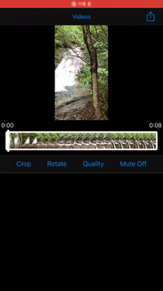
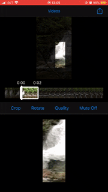
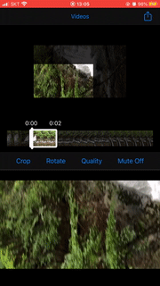
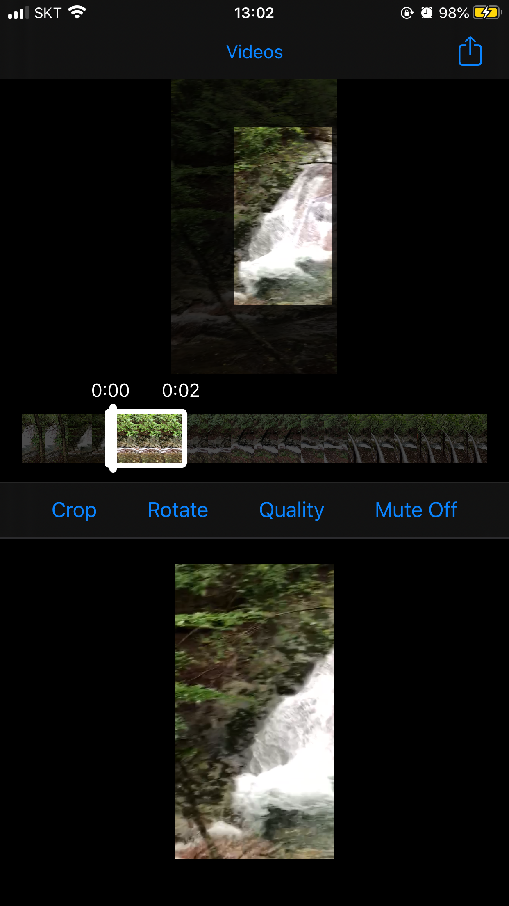
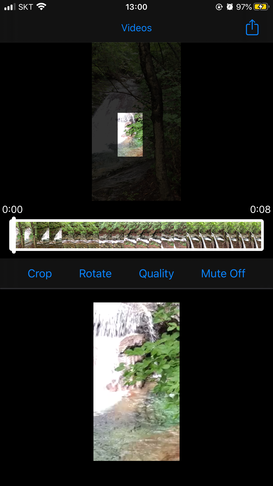
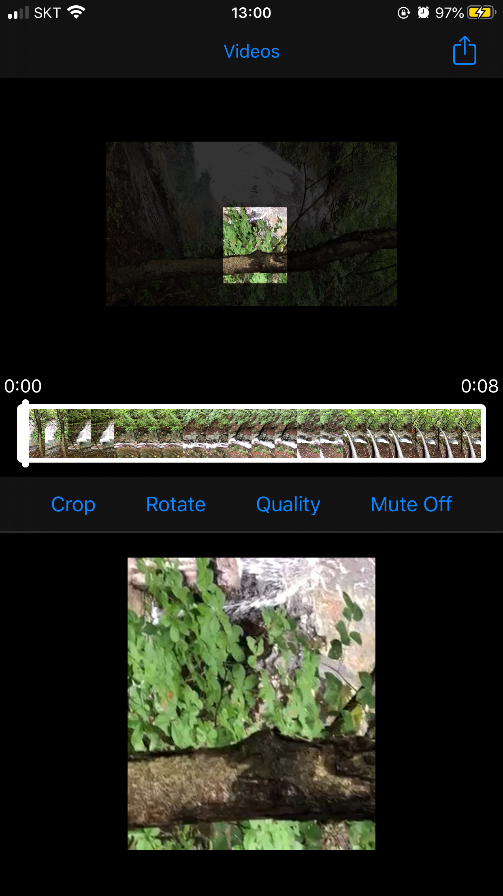

# VideoConverter

[](https://travis-ci.org/pikachu987/VideoConverter)
[](https://cocoapods.org/pods/VideoConverter)
[](https://cocoapods.org/pods/VideoConverter)
[](https://cocoapods.org/pods/VideoConverter)

[](https://developer.apple.com/swift/)

## Introduce

Video can be cropped by x, y, width, and height, and can be rotated 0, 90, 180, 270 degrees.
And you can adjust the duration of video playback with startTime and endTime or durationTime, and you can also mute mode.

<br/>

### VideoConverter

|-|-|-|
|---|---|---|
||||

|Trim|Crop|Rotate|
|---|---|---|
||||

## Requirements

## Installation

VideoConverter is available through [CocoaPods](https://cocoapods.org). To install
it, simply add the following line to your Podfile:

```ruby
pod 'VideoConverter'
```

## Usage

```swift
import VideoConverter
```

```swift
let videoConverter = VideoConverter(asset: asset)
videoConverter.convert { (url, error) in
    
}
```

### convert

```swift
videoConverter.convert(<#T##option: ConverterOption?##ConverterOption?#>, progress: <#T##((Double?) -> Void)?##((Double?) -> Void)?##(Double?) -> Void#>, completion: <#T##((URL?, Error?) -> Void)##((URL?, Error?) -> Void)##(URL?, Error?) -> Void#>)
```

```swift
var videoConverterCrop: ConverterCrop?
if let dimFrame = self.videoView.dimFrame {
    videoConverterCrop = ConverterCrop(frame: dimFrame, contrastSize: self.videoView.videoRect.size)
}

videoConverter.convert(ConverterOption(
    trimRange: CMTimeRange(start: self.videoTrim.startTime, duration: self.videoTrim.durationTime),
    convertCrop: videoConverterCrop,
    rotate: CGFloat(.pi/2 * self.rotate),
    quality: self.preset,
    isMute: self.isMute), progress: { [weak self] (progress) in
        self?.progressView.setProgress(Float(progress ?? 0), animated: false)
}, completion: { [weak self] (url, error) in
    if let error = error {
        let alertController = UIAlertController(title: nil, message: error.localizedDescription, preferredStyle: .alert)
        alertController.addAction(UIAlertAction(title: "Confirm", style: .default, handler: nil))
        self?.present(alertController, animated: true)
    } else {
        self?.convertVideoView.url = url
        self?.progressView.setProgress(0, animated: false)
    }
})
```

### ConverterOption

```swift
var trimRange: CMTimeRange // Start time and end time or start time and duration time
var convertCrop: ConverterCrop // Crop position, size
var rotate: CGFloat // radian rotation
var quality: String // Video quality
var isMute: Bool // Mute mode
```

### ConverterCrop

```swift
var frame: CGRect // Crop position, size
var contrastSize: CGSize // Crop reference size
```

## Author

pikachu987, pikachu77769@gmail.com

## License

VideoConverter is available under the MIT license. See the LICENSE file for more info.
